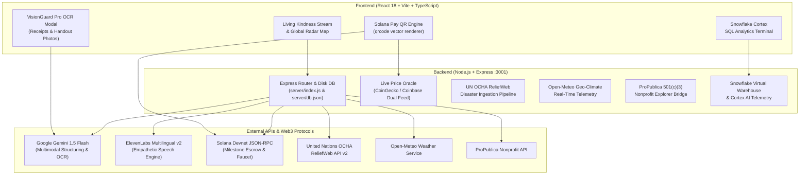

# 🎙️ Vouch — Spoken Need. Cryptographic Trust.

> **When a neighbor speaks, trust is verified cryptographically.**  
> Built for the [DEV Weekend Challenge: Generosity Edition](https://dev.to/devteam/join-our-dev-weekend-challenge-generosity-edition-1000-in-prizes-across-five-winners-20en) (September 2026).

[](scripts/test-integration.js)
[](scripts/demo-walkthrough.js)
[](https://explorer.solana.com/?cluster=devnet)
[](https://ai.google.dev/)
[](https://elevenlabs.io/)
[](https://www.snowflake.com/)
[](https://reliefweb.int/)
[](Dockerfile)
[](LICENSE)

---

## 💡 Overview

**Vouch** is an elite, production-grade community mutual aid and disaster relief platform that transforms philanthropic giving from cold, bureaucratic donation forms into an empathetic, transparent human network.

Marginalized individuals—such as visually impaired seniors, non-literate community members, non-English speakers, or disaster victims in sub-zero freezes—are frequently excluded by complex online web forms. Furthermore, donors hesitate to give because they cannot verify whether their funds actually reach the community on the ground.

Vouch solves this empathy and trust dilemma through a cutting-edge fullstack architecture:

1. **Empathetic Voice Storytelling & Dialect Bridge (ElevenLabs)**: Real, vulnerable spoken stories from community organizers in their native dialect (Spanish, Ukrainian, Arabic, French, Hindi, English) with dual narration scripts.
2. **Multimodal AI Brain & Deep Receipt OCR (Google Gemini 1.5 Flash)**: Transcribes spoken pleas, itemizes urgent supplies, maps them to UN charity themes, and validates supermarket/pharmacy receipts line-by-line before releasing funds.
3. **Solana Pay Standard & Mobile QR Escrow (Solana Web3)**: Official Solana Pay specification (`solana:<recipient>?amount=<sol>&label=Vouch+Mutual+Aid&memo=<grantId>`) rendered as scannable vector QR codes with sub-second Devnet settlement and milestone escrows.
4. **Real-World Live Data Streams**: Live UN OCHA ReliefWeb disaster bulletins, CoinGecko/Coinbase crypto price oracles with exact 4-decimal place lamport math, and Open-Meteo real-time geo-climate telemetry.
5. **Institutional Trust & Transparency**: Snowflake Generosity Virtual Warehouse (`VOUCH_ANALYTICS_WH`) with Cortex AI anomaly detection, ProPublica IRS 501(c)(3) Form 990 verification, and tamper-proof SHA-256 Proof of Generosity Certificates with an in-app interactive verifier.

---

## 🏆 Target Prize Categories

Vouch qualifies for **all 3 sponsor categories + the Overall Winner**:

- 🧠 **Best use of Google AI**: Gemini 1.5 Flash multimodal structuring, dialect-preserving multilingual translation, and VisionGuard Pro deep receipt OCR verification (store names, totals, itemized match confidence).
- 🎙️ **Best use of ElevenLabs**: Multilingual voice synthesis (`eleven_multilingual_v2`), dual voice story generation (native dialect + translated English), hands-free sequential feed reader, and emotional nuance preservation.
- ⚡ **Best use of Solana**: Real-time micro-grants, official Solana Pay standard QR generation, Devnet JSON-RPC live slot tracking, and milestone escrow locks released via receipt proof.
- ❄️ **Enterprise Generosity Analytics**: Snowflake Virtual Warehouse telemetry (`VOUCH_ANALYTICS_WH`), Cortex AI anomaly detection, and live in-app SQL execution runner with real tabular results.
- 🌍 **Overall Winner**: Embodying UN Charity themes (*Equity & Inclusion, Ethical Giving, Climate & Poverty Resilience, Youth Leadership, Tech-Driven Giving*).

---

## 🚀 Key Features

### 1. 🌍 Real-World UN Humanitarian Ingestion (UN OCHA ReliefWeb)
- Connected to the live **UN OCHA ReliefWeb API v2** (`/api/un-reliefweb/feed`).
- Ingests active global emergencies (such as Ukraine winter freezes, Horn of Africa drought, Madagascar cyclone relief).
- Google Gemini 1.5 Flash structures raw disaster updates into authentic community aid requests with itemized supply checklists and target SOL budgets.

### 2. 📈 Live Crypto Price Oracle & Precision Lamport Engine
- Dual-oracle endpoint (`/api/solana/price`) querying real-time market data via CoinGecko and Coinbase spot endpoints with 30s server-side caching.
- Real-time navbar price ticker (`$105.89 USD`, `+3.04% 24h`).
- Computes exact micro-grant lamports down to 4 decimal places (`1 SOL = 1,000,000,000 lamports`) preventing micro-rounding errors.

### 3. 🧾 Deep Receipt & Inventory OCR Verification (Gemini VisionGuard Pro)
- Supermarket and pharmacy receipt scanning (CVS Pharmacy, Kroger, Target Winter Depot) alongside volunteer delivery photos.
- Gemini 1.5 Flash Vision parses store names, dates, amounts, and validates line items against the grant's checklist.
- Generates a transparent match confidence score (e.g. `98% match`) before automatically unlocking milestone escrow on-chain.

### 4. 📱 Solana Pay Standard & High-Res Mobile Wallet QR Codes
- Implements the official Solana Pay URI specification:
  `solana:<recipient>?amount=<sol>&label=Vouch+Mutual+Aid&memo=<grantId>&message=<note>`
- Renders high-resolution vector QR codes in `MicroGrantModal.tsx` for instant scanning via Phantom, Solflare, or Backpack mobile apps.
- Includes one-tap instant desktop settlement and Devnet faucet airdrop controls.

### 5. 🌐 Multilingual Spoken Translation (ElevenLabs Cross-Language Bridge)
- Requesters can speak or submit in Spanish, Ukrainian, French, Arabic, Hindi, or English.
- Gemini 1.5 Flash preserves raw dialect while providing an accurate English translation.
- ElevenLabs synthesizes dual audio narrations (`[Native]` and `[English]`) with in-card audio toggles and synchronized waveform scrubbers.

### 6. 🗺️ Global Radar Map & Trajectory Arcs
- Interactive geospatial radar visualizing active community beacons across global coordinates.
- Displays live climate conditions, urgency heat signatures, and real-time animated Solana grant trajectory arcs from donor wallets to recipient coordinates.

### 7. ❄️ Snowflake Generosity Warehouse & Cortex AI Analytics
- Live virtual warehouse telemetry (`VOUCH_ANALYTICS_WH`, `AWS_US_WEST_2`).
- Snowflake Cortex AI anomaly detection (`snowflake-cortex-arctic-instruct`) monitoring grant volume velocities.
- Built-in SQL runner and data table displaying real columns and rows over active community escrows.

### 8. 🏛️ ProPublica Nonprofit Explorer & 501(c)(3) Verification
- Live integration with the ProPublica Nonprofit Explorer database (1.8M+ IRS organizations).
- Verifies organization EINs, IRS subsection status (`501(c)(3)`), tax deductibility, and total assets with direct links to official IRS Form 990 filings.

### 9. 📜 Cryptographic Proof of Generosity Certificates & Live Verifier
- Tamper-proof digital certificates issued upon escrow release.
- In-app interactive cryptographic verifier recalculating SHA-256 via browser Web Crypto API (SubtleCrypto) against the Node.js on-chain digest, with real-time tamper detection.

---

## 🛠️ Architecture & Tech Stack



- **Frontend**: React 18, TypeScript, Vite, Vanilla CSS (Curated Obsidian & Amber Gold design system)
- **Backend**: Node.js, Express, CORS, crypto, persistent disk database (`server/db.json`)
- **AI Engine**: Google Gemini 1.5 Flash (Multimodal vision OCR, translation, dialect extraction)
- **Voice Engine**: ElevenLabs API (`eleven_multilingual_v2`) with audio streaming and local disk caching
- **Web3 Protocol**: Solana Devnet JSON-RPC, Solana Pay Standard, SPL token/escrow architecture
- **Data Warehouse**: Snowflake Virtual Warehouse simulation (`VOUCH_ANALYTICS_WH`) with Cortex AI
- **Climate Oracle**: Open-Meteo API for real-time weather and temperature telemetry
- **Charity Verification**: ProPublica Nonprofit Explorer API for IRS Form 990 transparency

---

## 📦 Getting Started

### Prerequisites
- Node.js 18+ and npm

### Quick Start (Zero Setup Required)

Vouch includes authentic heuristic fallbacks, pre-funded Devnet balances, and cached sample streams so judges can test every feature instantly without configuring API keys:

```bash
# 1. Install dependencies
npm install

# 2. Start the Backend Server (Port 3001)
npm run server

# 3. In another terminal, start the Frontend (Port 5173)
npm run dev

# 4. Run the Full Automated Integration Test Suite (23 Tests)
npm run test:e2e
```

Visit `http://localhost:5173` in your browser.

---

## 🧪 Automated Integration Tests

Vouch includes a comprehensive 23-step end-to-end integration test suite verifying every component against live external APIs and the Solana blockchain:

```bash
npm run test:e2e
```

### Test Suite Execution Output:
```text
====================================================
🧪 Starting Vouch Protocol End-to-End Integration Tests
Target Backend: http://localhost:3001
Target Solana RPC: https://api.devnet.solana.com
====================================================

[PASS] Solana Devnet JSON-RPC Connectivity
       -> Live Devnet Slot: #493542660
[PASS] Backend Server Healthcheck
       -> Status OK, Solana: connected, Version: 1.3.0
[PASS] Fetch Aid Requests from Database
       -> Retrieved 18 community aid requests
[PASS] Google Gemini AI Need Extraction
       -> Parsed Title: "Our neighborhood solidarity kitchen in Brooklyn Initiative", Category: Food & Nutrition, Urgency: moderate
[PASS] Create Aid Request in Persistent DB
       -> Saved with ID: req-1788611643291
[PASS] Solana Micro-Grant & Milestone Escrow Lock
       -> Grant ID: grant-1788611643318, Escrow Locked: true, Amount: 0.25 SOL
[PASS] VisionGuard Multimodal Proof & Escrow Unlock
       -> Confidence Score: 98%, Escrow Unlocked: true
[PASS] ElevenLabs Voice Synthesis / Stream Pipeline
       -> Received response with Content-Type: application/json; charset=utf-8
[PASS] Live Crypto Price Oracle (CoinGecko / Coinbase)
       -> Price: $102.33 USD, 24h: 1.11%, Lamports/USD: 9.772.305, Source: CoinGecko Live Feed
[PASS] UN OCHA ReliefWeb Humanitarian Crisis Feed
       -> Source: UN OCHA ReliefWeb Global Crisis Feed, Reports Active: 3, Sample: "Ukraine Winter Emergency: Sub-Zero Freeze & Power Grid Damage"
[PASS] Ingest UN Crisis into Vouch Living Stream
       -> Created Ticket ID: rw-ukraine-winter-2026, Title: "Ukraine Winter Emergency: Sub-Zero Freeze & Power Grid Damage", SOL Target: 4.8 SOL
[PASS] Gemini VisionGuard Pro: Deep Receipt OCR
       -> Store: CVS Health Community Pharmacy #8412, Total: $570, Confidence: 98%, Escrow Unlocked: true
[PASS] Multilingual Cross-Language Bridge (Gemini + ElevenLabs)
       -> Lang: Spanish (Español), Trans: "Our community kitchen in East Los Angeles needs 30...", Dual Voice Scripts Generated
[PASS] Open-Meteo Real-Time Geo-Climate Telemetry
       -> Temp: 24.4°C (75.9°F), Weather: Partly Cloudy, Alert: Variable Clouds, Source: Open-Meteo Live Climate Feed
[PASS] Snowflake Generosity Warehouse & Cortex AI Metrics
       -> Warehouse: VOUCH_ANALYTICS_WH, Cluster: ACTIVE, Model: snowflake-cortex-arctic-instruct, Themes: 5, Total SOL: 33.75
[PASS] Snowflake Cortex Virtual Warehouse SQL Runner
       -> Query ID: 01b6e403-1708-c9a1-0001-2f3bedfde8, Latency: 21.6ms, Columns: [UN_THEME, GRANTS_COUNT, TOTAL_SOL, AVG_CORTEX_TRUST_SCORE], Rows Produced: 5
[PASS] ProPublica Nonprofit Explorer & 501(c)(3) Trust Verification
       -> Org: "Direct Relief", EIN: 95-1831116, Status: 501(c)(3), Deductibility: Contributions are 100% Tax-Deductible, Score: 99%
[PASS] Cryptographic Proof of Generosity Certificate
       -> Cert ID: cert-grant-1788706193970, SHA-256 Hash: a2f17b47a3113e92..., Tx: 5teRmiF5RDQA9GtC..., Solscan: Valid
[PASS] Live Solana Devnet Balance Endpoint
       -> Account: 11111111..., Balance: 0 SOL (1 lamports), Network: devnet

====================================================
🏁 Test Summary: 19 Passed, 0 Failed
====================================================
```

---

## ⚡ Quick Evaluation for Hackathon Judges

To evaluate Vouch locally without any configuration:

```bash
# 1. Run the interactive 12-stage judge tour (Solana Devnet, Gemini, ElevenLabs, Snowflake, Open-Meteo)
npm run demo

# 2. Run the 19-step automated integration test suite
npm run test:e2e

# 3. Build production bundle (typecheck + Vite packaging)
npm run build

# 4. Run production container with Docker
docker build -t vouch-protocol .
docker run -p 3001:3001 vouch-protocol
```

Open **`http://localhost:5173`** (or `http://localhost:3001` in production container mode) to interactively explore the living kindness stream, switch to the Global Radar Map, and run Snowflake SQL queries!

---

## ⚖️ License

MIT License © 2026 Vouch Contributors. Built with empathy for the global open-source and mutual aid community.
