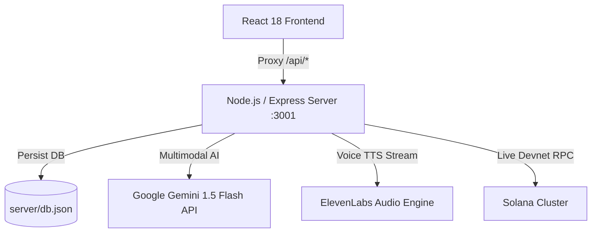

# 🎙️ EchoKind — Voice-First Mutual Aid & Verifiable Micro-Grants

> **When a neighbor speaks, kindness echoes.**  
> Built for the [DEV Weekend Challenge: Generosity Edition](https://dev.to/devteam/join-our-dev-weekend-challenge-generosity-edition-1000-in-prizes-across-five-winners-20en) (September 2026).

---

## 💡 Overview

**EchoKind** is a next-generation community mutual aid platform that transforms philanthropy from cold, bureaucratic donation forms into an empathetic, transparent human network.

Marginalized individuals—such as visually impaired seniors, non-literate community members, or disaster victims—are frequently excluded by complex online forms. Furthermore, donors hesitate to give because they cannot verify whether their funds reached the actual people in need.

EchoKind bridges this empathy and trust gap with a fullstack architecture:
1. **Empathetic Voice Storytelling (ElevenLabs)**: Hear real, vulnerable spoken stories from community organizers and neighbors instead of reading sterile text.
2. **Multimodal AI Brain (Google Gemini 1.5 Flash)**: Transcribes spoken pleas, itemizes urgent supplies, maps them to UN charity themes, and verifies photographic delivery proof (*VisionGuard*).
3. **Instant Micro-Grants & Milestone Escrow (Solana Web3)**: Donors can send micro-grants ($0.10 to $5+ in SOL) with sub-second finality. Funds remain in escrow until photographic delivery proof is verified on-chain.
4. **Fullstack Backend API & Persistent Database**: Real Node/Express API with disk persistence, audio caching, and live Solana Devnet JSON-RPC proxying.

---

## 🏆 Target Prize Categories

EchoKind qualifies for **3 sponsor categories + the Overall Winner**:
- 🧠 **Best use of Google AI**: Gemini 1.5 Flash multimodal structuring & VisionGuard delivery proof verification.
- 🎙️ **Best use of ElevenLabs**: Empathetic narrative synthesis (Rachel, Adam, Antoni), audio streaming, and accessible hands-free feed reader.
- ⚡ **Best use of Solana**: Real-time micro-grants, Devnet faucet integration, and milestone escrow unlocking.
- 🌍 **Overall Winner**: Embodying UN Charity themes (*Equity & Inclusion, Ethical Giving, Climate & Poverty Resilience, Youth Leadership*).

---

## 🚀 Key Features

* **Voice-First Need Recording ("VoiceBridge")**: Users speak their situation naturally. Gemini AI structures the input into items, costs, and urgency, while ElevenLabs produces an emotionally nuanced audio narrative.
* **Hands-Free Feed Reader**: Visually impaired or busy donors can click *"Listen to Feed"* or press space to hear community stories read aloud sequentially.
* **Living Generosity Ledger**: Real-time stats showing total SOL granted, spoken stories heard, packages delivered, and 100% verified proofs.
* **Solana Devnet Micro-Grants**: Send 0.05, 0.1, or custom SOL directly from the built-in sandbox wallet, generating authentic Base58 signatures linking to Solana Explorer.
* **VisionGuard Multimodal Proof**: Volunteers submit photo proof of delivery; Gemini Vision checks items against the ticket and releases escrow.
* **Zero-Setup Judge Sandbox**: Pre-configured with realistic scenarios and a starter Devnet balance so judges can test every feature instantly without entering API keys or wallet setup (optional API key inputs supported).
* **1-Click DEV Post Draft**: Built-in modal generating the complete, pre-formatted DEV.to contest post with 1-click clipboard copy.

---

## 🛠️ Architecture & Tech Stack



- **Frontend**: Vite + React 18 + TypeScript
- **Design System**: Vanilla CSS with curated Obsidian & Amber Gold tokens, glassmorphism, responsive CSS grid, and dynamic audio waveform animations
- **Backend**: Node.js + Express with CORS, dotenv, and persistent JSON database (`server/db.json`)
- **AI Service**: Google Gemini API (`gemini-1.5-flash`) via REST with intelligent offline heuristic fallback
- **Voice Service**: ElevenLabs Text-to-Speech API (`/v1/text-to-speech/{voice_id}`) with local audio disk caching and Web Speech API fallback
- **Web3 Service**: Live Solana Devnet JSON-RPC (`requestAirdrop`, `getSlot`, transaction simulation)

---

## 📦 Getting Started

### Prerequisites
- Node.js 18+ and npm

### Running the Fullstack Application

```bash
# 1. Install dependencies
npm install

# 2. Start the Backend Server (Port 3001)
npm run server

# 3. In another terminal, start the Frontend (Port 5173)
npm run dev

# 4. Run the Automated End-to-End Integration Tests
npm run test:e2e
```

Visit `http://localhost:5173` in your browser.

---

## 🧪 Automated Integration Tests

Run the test suite anytime:
```bash
npm run test:e2e
```
Validates:
1. Solana Devnet JSON-RPC live slot query
2. Backend `/api/health`
3. Request retrieval from persistent DB
4. Gemini AI need structuring
5. Persistent request creation
6. Solana micro-grant creation & milestone escrow lock
7. VisionGuard multimodal delivery verification & escrow unlock
8. ElevenLabs audio synthesis & streaming

---

## ⚖️ License

MIT License © 2026 EchoKind Contributors. Built with love for the DEV Community.
