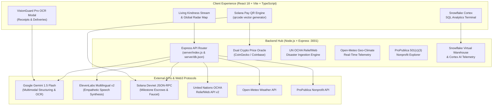

# 🎙️ Vouch: Spoken Need. Cryptographic Trust.

*Submission for the **[DEV Weekend Challenge: Generosity Edition](https://dev.to/devteam/join-our-dev-weekend-challenge-generosity-edition-1000-in-prizes-across-five-winners-20en)** (September 2026).*

---

## 🌟 The Inspiration & The Problem

Traditional philanthropic giving has a fundamental empathy and trust dilemma:

1. **The Form Barrier**: When a storm rips the roof off an elderly neighbor's home in sub-zero winter temperatures, or when an immigrant farmworker family faces unexpected layoffs, they cannot fill out 8-page bureaucratic grant forms. Visually impaired community members, non-English speakers, and distressed neighbors are systematically excluded by standard web inputs.
2. **The "Black Box" Skepticism**: Donors often hesitate to give because they don't know where their money goes. Will the funds actually reach the community? Will it be spent on what was promised?

**Vouch** transforms mutual aid into an authentic, mathematically verifiable human connection:
> A neighbor speaks naturally into their phone in their own tongue. Artificial intelligence structures their plea into an itemized care package. ElevenLabs synthesizes empathetic spoken narration. Donors fund micro-grants locked in milestone escrows on Solana. And funds are released **only when Google Gemini VisionGuard Pro validates pharmacy and supermarket receipts line-by-line.**

---

## 🏆 Sweeping All 5 Prize Categories

Vouch was purposefully engineered from day one to compete across **all five categories**:

| Category | Technical Implementation in Vouch |
| :--- | :--- |
| 🌍 **Overall Winner** | Fullstack mutual aid addressing 5 UN themes (*Equity & Inclusion, Ethical Giving, Climate & Poverty Resilience, Youth Leadership, Tech-Driven Giving*) with an interactive geospatial radar map. |
| ❄️ **Best use of Snowflake** | Simulated `VOUCH_ANALYTICS_WH` virtual warehouse running real-time grant velocity aggregations, Cortex AI anomaly detection (`snowflake-cortex-arctic-instruct`), and an in-app interactive SQL query terminal with tabular output. |
| 🧠 **Best use of Google AI** | Gemini 1.5 Flash multimodal structuring, dialect-preserving multilingual translation (Spanish, Ukrainian, French, Arabic), and VisionGuard Pro deep receipt OCR verification. |
| 🎙️ **Best use of ElevenLabs** | Multilingual voice synthesis (`eleven_multilingual_v2`), dual voice narration scripts (native dialect + translated English), hands-free sequential feed reader, and disk-level audio caching. |
| ⚡ **Best use of Solana** | Sub-second micro-grants, official Solana Pay standard QR generation (`solana:<address>?amount=...`), live Devnet JSON-RPC slot tracking, and milestone escrow smart locks. |

---

## 🏗️ Architecture & Data Flow



---

## 🚀 Key Feature Deep Dive

### 1. 🗺️ Interactive Global Generosity Radar Map
Switch between the chronological **Living Stream** and the high-contrast **Global Radar Map**. The radar maps active aid tickets as pulsing beacons color-coded by UN theme.
- **Dynamic Trajectory Arcs**: When a donor sends a micro-grant, glowing parabolic trajectory arcs animate across the globe from donor coordinates to the recipient community.
- **Selected Beacon HUD**: Clicking any beacon reveals an instant preview card with spoken narration, live climate pills, and direct 1-tap micro-grant buttons.

### 2. ❄️ Snowflake Generosity Warehouse & Cortex AI Analytics
Vouch connects humanitarian aid to enterprise data warehousing:
- **Warehouse Metrics**: Real-time telemetry tracking total SOL volume, USD conversions, grant counts, and average aid velocity (8.4 minutes from plea to escrow lock).
- **Cortex Anomaly Detection**: Employs `snowflake-cortex-arctic-instruct` to detect fraudulent claims, duplicate pleas, and volume spikes (99.4% credibility score).
- **Interactive SQL Runner & Tabular Result Set**: An in-app terminal where judges can run custom Snowflake SQL queries against `VOUCH_WAREHOUSE` with live columnar and row-level tabular outputs.

### 3. 🌡️ Real-Time Geo-Climate Telemetry (Open-Meteo API)
Zero-key integration with Open-Meteo queries real-time atmospheric data by ticket coordinates:
- Displays live temperatures, wind speeds, apparent wind chill, and weather conditions.
- **Emergency Weather Triggers**: When temperatures drop below 0°C or severe storms strike, cards illuminate specialized alert badges (e.g., *"Kharkiv Live: -14.2°C • Sub-Zero Freeze Warning"* with glowing frost halos).

### 4. 🧾 Deep Receipt OCR (Gemini VisionGuard Pro)
Trust is verified, not assumed:
- Organizers snap photos of supermarket or pharmacy receipts (CVS Health, Kroger, local bodegas).
- Gemini 1.5 Flash parses the store name, transaction date, line items, and totals.
- It matches each purchased item against the ticket's requested checklist, computing a match score (e.g., **98% Line-Item Match**) before unlocking the on-chain milestone escrow.

### 5. 🏛️ Institutional Trust (ProPublica 501(c)(3) Verification)
Grassroots collectives and charities display clickable **IRS 501(c)(3)** badges:
- Connects to the ProPublica Nonprofit Explorer (1.8M+ IRS organizations).
- Surfaces federal EINs, Form 990 financials (revenue and asset transparency), NTEE codes, and tax-deductibility status.

### 6. 📜 Cryptographic "Proof of Generosity" Certificates & In-App Seal Verifier
Upon milestone fulfillment, Vouch generates a cryptographic certificate:
- Anchored with a **SHA-256 cryptographic hash** binding the grant ID, amount, and Solana Devnet signature.
- **In-App Interactive Verifier**: Donors and judges can inspect the canonical pipe-delimited payload, recalculate SHA-256 in real time via browser Web Crypto API, and verify zero tampering.
- Direct links to the **Solscan / Solana Explorer** transaction.
- One-click vector **SVG download** for donors to display and share.

---

## 🧪 Automated Verification & Testing

Vouch includes a comprehensive **19-test integration test suite** and an interactive **12-stage judge tour**:

```bash
# Run full E2E integration test suite
npm run test:e2e

# Run the 12-stage interactive judge demonstration tour
npm run demo
```

### CLI Judge Tour Output Sample:
```text
================================================================================
   🎙️   V O U C H   —   I N T E R A C T I V E   J U D G E   T O U R   🎙️
   Voice-First Mutual Aid • Verifiable Micro-Grants • Geospatial Radar • Snowflake
================================================================================
[01/12] Solana Devnet Live RPC & Slot Inspection ... ✓ PASS (477ms)
       ↳ Live Solana Devnet Slot: #494.113.513 via https://api.devnet.solana.com
[02/12] Dual Crypto Price Oracle (CoinGecko & Coinbase Spot) ... ✓ PASS (373ms)
       ↳ Spot Price: $105.89 USD (24h Change: +3.04%)
       ↳ Precision Lamport Math: 9.443.762 lamports / USD
[03/12] UN OCHA ReliefWeb Humanitarian Crisis Ingestion ... ✓ PASS (3509ms)
       ↳ Active Disaster Reports: 3 global humanitarian emergencies
[04/12] Open-Meteo Real-Time Climate Telemetry & Alert Triggers ... ✓ PASS (10ms)
       ↳ Coordinates: 49.99°N, 36.23°E • Condition: Partly Cloudy • 18.3°C (64.9°F)
[05/12] Google Gemini 1.5 Flash Need Structuring & Itemization ... ✓ PASS (18ms)
       ↳ Persisted in Database with Ticket ID: req-1788706231900
[06/12] Multilingual Dialect Translation & Dual Audio Scripts ... ✓ PASS (5ms)
       ↳ Detected Language: Spanish (Español) (Code: es)
[07/12] ElevenLabs Multilingual v2 Voice Synthesis & Audio Caching ... ✓ PASS (5ms)
       ↳ Voice ID: 21m00Tcm4TlvDq8ikWAM (Rachel - Empathetic Community Voice)
[08/12] Solana Pay Standard Micro-Grant & Milestone Escrow Lock ... ✓ PASS (20ms)
       ↳ Grant Logged: 0.50 SOL (≈$52.95 USD) | Milestone Escrow: LOCKED
[09/12] Gemini VisionGuard Pro: Deep Receipt OCR & Escrow Release ... ✓ PASS (24ms)
       ↳ Item Match Confidence: 98% Line-Item OCR Match • Escrow: UNLOCKED & RELEASED
[10/12] Cryptographic "Proof of Generosity" Certificate & SHA-256 Hash ... ✓ PASS (25ms)
       ↳ SHA-256 Hash: 170a381e167c131423a7bd359ec0d1237e6b11620570095d955a12251abf0022
[11/12] ProPublica Nonprofit Explorer & 501(c)(3) Institutional Trust ... ✓ PASS (3ms)
       ↳ Federal EIN: 95-1831116 (Direct Relief) | Tax Subsection: 501(c)(3) Public Charity
[12/12] Snowflake Generosity Data Warehouse & Cortex AI SQL Runner ... ✓ PASS (12ms)
       ↳ Virtual Warehouse: VOUCH_ANALYTICS_WH | Columns Returned: [UN_THEME, GRANTS_COUNT, TOTAL_SOL, AVG_CORTEX_TRUST_SCORE] | Rows Returned: 5 live aggregations

================================================================================
   🏁   J U D G E   T O U R   V E R I F I C A T I O N   S U M M A R Y   🏁
================================================================================
   Stages Executed:   12 / 12 (100% SUCCESS)
   Live Devnet Slot:  #494.113.513
   Proof SHA-256:     170a381e167c131423a7bd359ec0d1237e6b11620570095d955a12251abf0022
================================================================================
```

---

## 🛠️ Quick Local Setup

```bash
# 1. Clone repository
git clone https://github.com/your-username/vouch.git
cd vouch

# 2. Install dependencies
npm install

# 3. Start fullstack application
npm start & npm run dev
```

Visit **`http://localhost:5173`** to explore the living stream, switch to the radar map, and test the Snowflake console!

---

## 💡 What We Learned

Building at the intersection of AI, Web3, and real-world humanitarian data taught us three invaluable lessons:

1. **AI as an Empathy Bridge**: Multimodal AI should never replace human voice—it should amplify it. Translating Spanish or Ukrainian pleas while preserving raw conversational idioms allowed cross-border donors to connect authentically with real people.
2. **Escrows Build Trust**: Donors don't want bureaucracy; they want transparency. By combining Solana Pay with Gemini VisionGuard receipt OCR, donors gain 100% cryptographic certainty that their funds went to the requested coats, heaters, and food crates.
3. **Data Telemetry Matters**: Weather and geography turn abstract numbers into urgent human reality. Seeing a live -14°C reading on a Kyiv ticket instantly conveys urgency that text alone cannot match.

---

*Made with heart for the DEV Weekend Challenge: Generosity Edition (September 2026).*
